# OSD Database Security and ACID Compliance Notes

## Security Model Implementation

The normalized OSD database incorporates several security measures to protect against common vulnerabilities and attacks:

### Role-Based Security

1. **Three-Tier Role System**:
   - `app_readonly`: Limited to SELECT operations only - for reporting users
   - `app_user`: Standard user with SELECT, INSERT, UPDATE permissions but restricted DELETE access
   - `app_admin`: Full privileges for administrative operations

2. **Row-Level Security (RLS)**:
   - The database implements policies to restrict data access based on user context
   - Users can only view/modify data relevant to their role and organization

3. **Permission-Based Access**:
   - Each table has specific permissions granted to different roles
   - Prevents unauthorized access to sensitive data like payment information

### Protection Against Cyber Attacks

1. **SQL Injection Prevention**:
   - All user inputs are parameterized in queries
   - Validation of input at both application and database levels
   - No direct string concatenation in SQL statements

2. **Password Security**:
   - Passwords are never stored in plaintext
   - Automated hashing trigger ensuring passwords are always encrypted
   - Failed login tracking and account lockout mechanisms

3. **Session Management**:
   - Dedicated `user_session` table to track active sessions
   - Token-based authentication with expiration timestamps
   - IP address and user agent tracking to detect suspicious activities

4. **Audit Logging**:
   - Comprehensive logging of all database operations
   - Tracking of user actions for forensic analysis
   - Automatic logging of all data changes via triggers

## ACID Compliance

The database design ensures ACID properties (Atomicity, Consistency, Isolation, Durability) through:

1. **Atomicity**:
   - Transaction blocks for multi-table operations
   - Rollback capabilities for failed operations
   - Structured foreign key relationships to maintain data integrity

2. **Consistency**:
   - Constraints and validation rules (PRIMARY KEY, FOREIGN KEY, NOT NULL)
   - Trigger-based validations before data modifications
   - Domain integrity through appropriate data types and value constraints

3. **Isolation**:
   - Transaction isolation level set to 'read committed' by default
   - Ability to escalate to higher isolation levels for critical operations
   - Proper index creation to reduce lock contention

4. **Durability**:
   - PostgreSQL's WAL (Write-Ahead Logging) ensures committed data persists
   - Database backup infrastructure (not shown in schema but presumed)
   - Point-in-time recovery capabilities from transaction logs

## Database Triggers

The system employs multiple database triggers for automated processes:

1. **Audit Triggers**:
   - `log_table_changes()`: Records all data modifications with before/after values
   - Tracks which user made changes and when
   - Maintains a complete audit trail for compliance purposes

2. **Data Integrity Triggers**:
   - `hash_password()`: Ensures passwords are always properly hashed
   - `update_timestamp()`: Automatically updates modification timestamps

3. **Business Logic Triggers**:
   - Automatically calculates derived values (e.g., profit calculations)
   - Enforces business rules and validations
   - Maintains data consistency across related tables

## Additional Security Measures

1. **Data Encryption**:
   - Sensitive personal and financial data encryption
   - Transport layer security for data in transit
   - Document content encrypted at rest

2. **Access Monitoring**:
   - `user_action_log` tracks user behavior for analysis
   - Anomaly detection can be built on this data
   - IP address tracking to detect geographic anomalies

3. **Attack Surface Reduction**:
   - Minimal permissions for service accounts
   - Principle of least privilege applied throughout
   - Schema isolation for different functional areas
